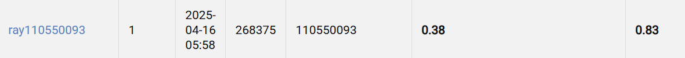

# NYCU Visual Recognition using Deep Learning HW2

Student ID: 110550093

Name: 蔡師睿

## Introduction
The task focuses on digit recognition using the SVHN dataset, which comprises 30,062 training images, 3,340 validation images, and 13,068 testing images. It involves two subtasks: digit classification with bounding box detection, and multi-digit number prediction.

## How to install

```bash
conda create -n hw2 python=3.10
conda activate hw2
pip install -r requirements.txt
```

## Usage

```bash
./run.sh
```

## Performance Snapshot


