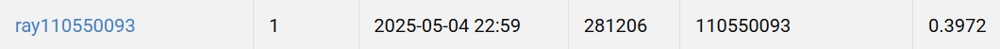

# NYCU Visual Recognition using Deep Learning HW3

Student ID: 110550093

Name: 蔡師睿

## Introduction
This task focuses on instance segmentation, a problem that requires both object detection and pixel-level delineation of individual object instances within an image. Unlike semantic segmentation, instance segmentation distinguishes between multiple objects of the same class by assigning unique labels and precise boundaries to each instance. The dataset consists of colored medical images, including 209 images for training and 101 images for testing. The challenge imposes several constraints, such as the use of only the Mask R-CNN model with a size limit of under 200 million parameters, and no reliance on external data.

## How to install

```bash
conda create -n hw3 python=3.10
conda activate hw3
pip install -r requirements.txt
```

## Usage

```bash
./run.sh
```

## Performance Snapshot

